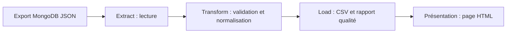

# Vélib’ : disponibilité des vélos par station

Un projet **ETL et visualisation** des stations Vélib’ réalisé avec Python, à partir d’un export JSON de MongoDB. Le pipeline nettoie les données, produit un CSV exploitable, contrôle leur qualité et génère une page HTML pour consulter les vélos disponibles par station.

> **Périmètre :** il s’agit d’une photographie des données contenues dans l’export fourni. La page ne récupère pas les disponibilités en temps réel.

## Captures et aperçu

**1. Données de départ dans MongoDB Compass.** La collection `VelibDB.velib_collection` contient les champs du nom de station, de disponibilité et de localisation utilisés dans le projet.


**2. Résultat du pipeline Python.** Aperçu rendu de `index.html` : indicateurs globaux et premières stations classées par nombre de vélos disponibles. Cette image montre un extrait du tableau ; le fichier HTML contient les 1 517 stations.


## Résultat

| Indicateur dans l’export | Valeur |
| --- | ---: |
| Stations enregistrées | 1 517 |
| Stations ouvertes à la location | 1 496 |
| Vélos disponibles dans les stations ouvertes | 18 155 |

La page affiche une ligne par station, avec son nom, sa commune, le total de vélos disponibles, le nombre de vélos classiques et électriques, ainsi que son statut de location. Les stations ouvertes sont présentées en premier, puis classées selon le nombre de vélos disponibles. Le tableau reste visible même si JavaScript est désactivé ; la recherche intégrée est un confort supplémentaire.

## Pipeline ETL



| Étape | Fichier | Opérations |
| --- | --- | --- |
| **Extract** | `etl_velib.py` | Lit les 1 517 documents de `VelibDB.velib_collection.json`. |
| **Transform** | `etl_velib.py` | Vérifie le code unique, le nom, la commune, les nombres, la cohérence classiques + électriques et les coordonnées ; sépare les lignes invalides. |
| **Load** | `etl_velib.py` | Écrit `data/stations_normalisees.csv`, `data/rejets.csv` et `data/rapport_qualite.json`. |
| **Présentation** | `visualiser_velib.py` | Lit **le CSV produit par l’ETL** et régénère `index.html`. |
| **Orchestration** | `pipeline.py` | Lance les étapes dans l’ordre avec une seule commande. |

Les lignes invalides seraient consignées dans `data/rejets.csv` avec leur numéro et le motif. Les écarts qui n’empêchent pas d’exploiter une station restent visibles dans le rapport de qualité.

### Contrôle qualité sur cet export

| Contrôle | Résultat |
| --- | ---: |
| Lignes lues, normalisées et chargées | 1 517 |
| Lignes rejetées | 0 |
| Dates `duedate` égales au 1er janvier 1970 | 1 517 |
| Stations où vélos + places dépassent la capacité déclarée | 16 |

Les 16 derniers écarts sont **signalés, sans correction arbitraire** : la somme des compteurs opérationnels n’est pas toujours égale à la capacité déclarée. Le champ `duedate` n’est pas utilisé pour dater les résultats.

## Voir la visualisation

Ouvrir **[`index.html`](index.html)** dans un navigateur après avoir téléchargé ou extrait les fichiers du projet. Aucun serveur et aucune dépendance Python ne sont nécessaires pour consulter la page déjà générée.

Le lien « Carte » de chaque station ouvre sa position sur OpenStreetMap ; cette fonction nécessite une connexion Internet.

## Exécuter le pipeline avec Python

**Prérequis :** Python 3.9 ou une version plus récente. Le script n’utilise que la bibliothèque standard.

1. Conserver les fichiers du projet ensemble après extraction du ZIP.
2. Depuis ce dossier, exécuter :

   ```bash
   python pipeline.py
   ```

   Sous Windows, si la commande `python` n’est pas reconnue, essayer `py pipeline.py`.

3. Consulter `data/rapport_qualite.json` et ouvrir `index.html` créé par le pipeline.

Exemple de sortie :

```text
ETL : 1517 lues, 1517 chargées, 0 rejetées.
1517 stations -> index.html
Pipeline terminé : data/stations_normalisees.csv, data/rapport_qualite.json et index.html.
```

## Organisation

```text
.
├── README.md                        Présentation du projet
├── pipeline.py                     Orchestration du traitement complet
├── etl_velib.py                    Extraction, transformation et chargement
├── visualiser_velib.py             Création de la page à partir du CSV
├── VelibDB.velib_collection.json   Export MongoDB utilisé
├── index.html                      Visualisation prête à consulter
├── data/
│   ├── stations_normalisees.csv    Données nettoyées
│   ├── rapport_qualite.json        Résultats des contrôles
│   └── rejets.csv                  Lignes écartées et motif
└── assets/
    ├── capture_mongodb.png         Capture du jeu de données dans Compass
    └── capture_visualisation.png   Aperçu rendu de la visualisation
```

## Traitement des données

L’ETL extrait les documents JSON et normalise les champs `stationcode`, `name`, `nom_arrondissement_communes`, `numbikesavailable`, `mechanical`, `ebike`, `is_renting` et `coordonnees_geo`. Ce dernier champ est une chaîne JSON contenant la latitude et la longitude : elle est décodée dans le CSV final. La visualisation lit ensuite ce CSV, trie les stations et génère les lignes du tableau dans le HTML. La recherche par nom ou par commune fonctionne dans le navigateur quand JavaScript est activé.

## Limites importantes

- **Adresse :** le jeu de données ne fournit pas d’adresse postale complète. Le nom de la station et sa commune servent de repère, et les coordonnées permettent de vérifier son emplacement.
- **Actualisation :** les quantités affichées correspondent à cet export. Une consultation ultérieure ne donne pas automatiquement la disponibilité du moment.
- **Horodatage :** `duedate` vaut le 1er janvier 1970 sur les 1 517 documents. Cette valeur n’est pas utilisée comme date fiable de collecte.
- **Arrondissements :** la commune est indiquée comme « Paris » pour les stations parisiennes, sans numéro d’arrondissement dans ce champ.

## Présentation courte

> J’ai mis en place un pipeline ETL en Python pour exploiter un export MongoDB de stations Vélib’. Il extrait les documents, valide et normalise les données, charge un CSV et produit un rapport de qualité. La page HTML générée à partir de ce CSV permet de rechercher une station, de voir les vélos disponibles et de la localiser. J’ai également identifié les limites du jeu de données, notamment l’absence d’adresse postale et d’horodatage fiable.
